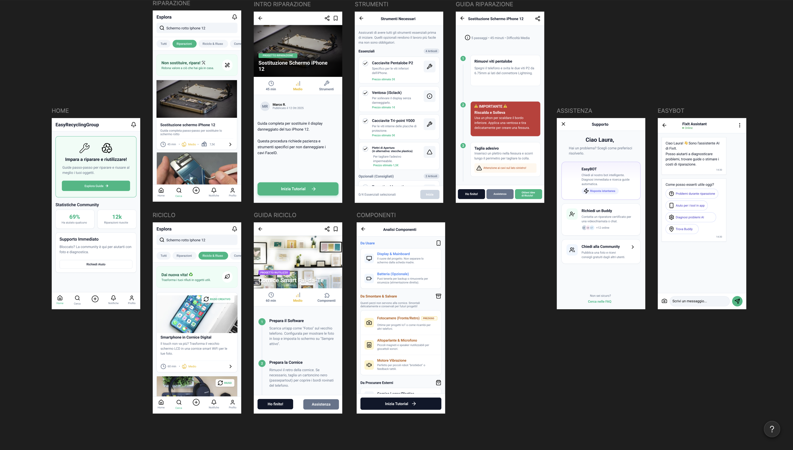

# Easy Recycling

## Progetto d'esame - Interazione Uomo-Macchina

**Easy Recycling** è un progetto realizzato per l'esame di **Interazione Uomo-Macchina**.  
L'obiettivo è progettare un'app mobile **iOS** capace di aiutare gli utenti a **riparare**, **riutilizzare** e **dare una seconda vita** agli oggetti, riducendo sprechi e abbandono.

## Cosa comprende il progetto

- Design e prototipizzazione dell'interfaccia di un'app mobile (iOS).
- Needfinding, analisi dei need e task, realizzazione di storyboards, realizzazione e testing di prototipi cartacei e poi digitali ad alta fedeltà.

## Attività svolte

1. Ricerca utenti tramite interviste e questionario.
2. Analisi dei dati raccolti e definizione dei bisogni principali.
3. Identificazione dei task più rilevanti e costruzione degli scenari d'uso.
4. Realizzazione di storyboard e prototipi low-fidelity su carta.
5. Iterazione progettuale fino ai prototipi high-fidelity digitali.
6. Testing con utenti esperti e non esperti, con miglioramenti progressivi.

## Contenuti della repository

- `Relazione Finale.pdf`: documento completo di progetto.
- `Interviste Integrali.pdf`: trascrizioni delle interviste qualitative.
- `Questionario Easy Recycling (Risposte).xlsx`: risposte del questionario e dati quantitativi.
- `Testing Prototipi.pdf`: risultati delle sessioni di test.
- `Prototipi/Low Fidelity/Paper Prototype v1.pdf`: prima versione cartacea.
- `Prototipi/Low Fidelity/Paper Prototype v2.pdf`: seconda versione cartacea.
- `Prototipi/High Fidelity/ReadMe.txt`: riferimento locale ai prototipi high-fidelity.

## Link principali

- Questionario: [Google Form](https://docs.google.com/forms/d/e/1FAIpQLSc3ApTe6Nquv9_na-xNjaPCuAPu9GKyixlORdn-Ky1BV0nyEw/viewform?pli=1)
- First High Fidelity: [Figma Prototype 1](https://www.figma.com/design/hSEH04GJwwUCEfzYyB64tp/Prototype-1?node-id=0-1&p=f&t=nIjdrwDnBVcKF8U9-0)
- Second High Fidelity: [Figma Prototype 2](https://www.figma.com/design/DOemL1xpOfLFqUvX24SIDn/Prototype-2?node-id=0-1&p=f&t=MlrapkrrYDJVJrsn-0)
- Third High Fidelity: [Figma Prototype 3](https://www.figma.com/design/IFtkkP87dCC0t0ckaJ0z1h/Prototype-3?node-id=0-1&p=f&t=n9mTn0k7VQf6nqqO-0)
